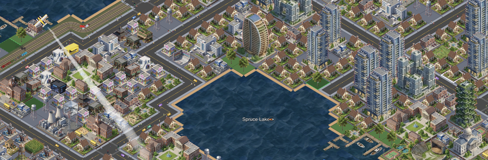

# FloodGuard Surabaya

Simulasi manajemen banjir isometrik untuk lima wilayah Surabaya. Bangun infrastruktur mitigasi, kelola curah hujan musiman, dan lindungi warga dari genangan air — dibangun dengan Next.js, TypeScript, dan HTML5 Canvas.

**Mainkan:** [floodguard-surabaya.vercel.app](https://floodguard-surabaya.vercel.app/)



## Tentang

FloodGuard Surabaya mengubah engine kota isometrik menjadi simulasi banjir berbasis peta nyata. Setiap wilayah memiliki heightmap elevasi dari data Surabaya; air mengalir mengikuti gravitasi saat musim hujan (Nov–Apr). Pemain memenangkan permainan dengan bertahan selama N hari event hujan tanpa melampaui batas genangan wilayah.

Proyek ini dikembangkan sebagai bagian dari komunitas **Institut Teknologi Sepuluh Nopember (ITS)**.

| | |
|---|---|
| **Developer** | Alvin Zanua Putra |
| **Komunitas** | Institut Teknologi Sepuluh Nopember (ITS) |
| **Repository** | [github.com/alvinzanuaputra/isometric-floodguard-simulationgames](https://github.com/alvinzanuaputra/isometric-floodguard-simulationgames) |
| **Live** | [floodguard-surabaya.vercel.app](https://floodguard-surabaya.vercel.app/) |

## Cara Main

1. **Permainan Baru** → pilih salah satu dari 5 wilayah Surabaya di layar pemilihan peta.
2. **Bangun infrastruktur** — pompa banjir, tanggul, waduk penampung, saluran drainase, pos evakuasi.
3. **Pantau cuaca** — prakiraan 6 jam di bilah atas; siapkan mitigasi sebelum Badai.
4. **Overlay Risiko Banjir** — lihat area rawan (merah) vs aman (hijau) berdasarkan elevasi.
5. **Menang** — bertahan N hari event hujan tanpa genangan melebihi threshold wilayah.
6. **Kalah** — area tergenang terlalu lama di atas batas bahaya.

Contoh save siap pakai tersedia di landing (**Muat Contoh**) dan di **Pengaturan → Alat Pengembang**.

## Lima Wilayah & Kesulitan

| Wilayah | Tingkat | Target Menang | Catatan |
|---|---|---|---|
| **Surabaya Barat** | Pemula | 5 hari hujan | Area rawan rendah (~1% tier-0) |
| **Surabaya Pusat** | Mudah | 7 hari | Elevasi rata-rata sedang |
| **Surabaya Selatan** | Menengah | 10 hari | ~16% area rawan |
| **Surabaya Timur** | Sulit | 14 hari | ~29% area rawan, elevasi rendah |
| **Surabaya Utara** | Ekstrem | 18 hari | Wilayah paling rawan |

## Fitur Utama

- **Simulasi banjir per-tile** — cellular automaton gravitasi + pompa, tanggul, waduk
- **Cuaca Surabaya** — musim hujan Nov–Apr, event gerimis → badai
- **Rendering isometrik** — 6 layer canvas, partikel hujan, langit mendung
- **Kendaraan evakuasi** — perahu, helikopter SAR, truk BPBD (tinting procedural)
- **Penyimpanan lokal** — key `floodguard-*` di localStorage
- **Bahasa Indonesia** — UI dan tips dalam Bahasa Indonesia

## Tech Stack

- **Framework:** [Next.js 16](https://nextjs.org/) + React 19
- **Bahasa:** TypeScript (strict)
- **Grafis:** HTML5 Canvas (tanpa game engine eksternal)
- **i18n:** [gt-next](https://gt-next.dev/) — locale `id` saja (infrastruktur tetap terpasang)
- **UI:** shadcn/ui + Tailwind CSS

## Memulai (Development)

```bash
git clone https://github.com/alvinzanuaputra/isometric-floodguard-simulationgames.git
cd isometric-floodguard-simulationgames
npm install
npm run dev
```

Buka [http://localhost:3000](http://localhost:3000).

### Perintah Berguna

| Perintah | Fungsi |
|---|---|
| `npm run dev` | Server pengembangan |
| `npm run build` | Build produksi (+ kompresi gambar) |
| `npm run lint` | ESLint |
| `npm run preprocess-maps` | Regenerasi `SBY_*_processed.json` dari peta mentah |
| `npm run generate-example-states` | Regenerasi contoh save di `public/example-states/` |

## Regenerasi Peta (Preprocessing)

File runtime hanya memuat `public/map-data/SBY_*_processed.json` (< 500 KB per wilayah). File mentah `SBY_*.json` (~100 MB total) **tidak** masuk build Vercel.

```bash
# Letakkan file mentah di public/map-data/SBY_{Wilayah}.json
npm run preprocess-maps
```

Output: `SBY_Barat_processed.json`, `SBY_Pusat_processed.json`, dll. — commit ke repo.

## Deploy ke Vercel

1. **Import** repositori GitHub ke [Vercel](https://vercel.com).
2. **Build command:** `npm run build` (default)
3. **Output:** Next.js App Router (otomatis)
4. **Env vars (opsional)** — hanya untuk co-op multiplayer:
   - `NEXT_PUBLIC_SUPABASE_URL`
   - `NEXT_PUBLIC_SUPABASE_PUBLISHABLE_KEY`
   
   Game single-player **berjalan penuh tanpa** env Supabase. Co-op nonaktif dari UI.

5. Pastikan `public/map-data/SBY_*_processed.json` ter-commit sebelum deploy.

## Kontribusi

Laporan bug dan saran fitur melalui [GitHub Issues](https://github.com/alvinzanuaputra/isometric-floodguard-simulationgames/issues).

## Lisensi

MIT — lihat [`LICENSE`](LICENSE).

---

Dikembangkan oleh **Alvin Zanua Putra** · Komunitas Institut Teknologi Sepuluh Nopember
