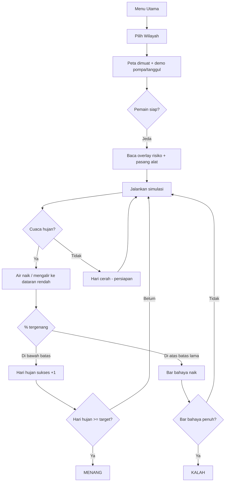

# FloodGuard Surabaya — Konsep Game & Analisis Kelayakan SD

> Dokumen acuan konsep permainan, cara bermain, tempo, dan kelayakan untuk pembelajaran di kelas SD.
> Disusun dari desain `agent/floodguard-plan.md`, `README.md`, dan implementasi kode.

---

## 1. Ringkasan Konsep

**FloodGuard Surabaya** adalah simulasi **manajemen banjir** berbasis peta nyata lima wilayah Surabaya. Pemain berperan sebagai koordinator mitigasi bencana — bukan membangun kota besar, melainkan **melindungi warga dari genangan air** saat musim hujan.

| Aspek | Keterangan |
|-------|------------|
| **Genre** | Simulasi strategi / manajemen bencana |
| **Setting** | Kota Surabaya, musim hujan November–April |
| **Tantangan** | Curah hujan naik → air mengalir mengikuti elevasi → area rendah tergenang |
| **Peran pemain** | Pasang infrastruktur mitigasi, pantau cuaca, jaga % genangan tetap aman |
| **Metrik utama** | Indeks Keamanan, % tergenang, hari hujan yang berhasil dilewati |
| **Bahasa** | Bahasa Indonesia |
| **Platform** | Web (Next.js + HTML5 Canvas), desktop & mobile |

### Transformasi dari city-builder ke simulasi banjir

| Aspek | IsoCity (asal) | FloodGuard Surabaya |
|-------|----------------|---------------------|
| Tujuan | Tumbuhkan kota, populasi, kebahagiaan | Lindungi wilayah dari banjir |
| Ketegangan | Demand R/C/I, anggaran | Curah hujan musiman, ketinggian air |
| Menang/kalah | Tidak ada (sandbox) | Bertahan N hari hujan tanpa melampaui batas genangan |
| Peta | Generate acak | 5 peta mandiri dari data Surabaya |
| Bangunan utama | Zona R/C/I | Pompa, tanggul, waduk, saluran, pos evakuasi |

---

## 2. Lima Wilayah & Tingkat Kesulitan

Setiap wilayah punya peta, elevasi, dan aturan menang/kalah berbeda.

| Wilayah | Label | Hari hujan sukses (target menang) | Batas tergenang aman | Area rawan (tier-0) | Elevasi rata-rata |
|---------|-------|-----------------------------------|----------------------|---------------------|-------------------|
| **Surabaya Barat** | PEMULA | 5 hari | ≤ 20% | ~1,1% | 13,2 m |
| **Surabaya Pusat** | MUDAH | 7 hari | ≤ 25% | ~2,2% | 9,1 m |
| **Surabaya Selatan** | MENENGAH | 10 hari | ≤ 30% | ~15,9% | 8,7 m |
| **Surabaya Timur** | SULIT | 14 hari | ≤ 40% | ~29,2% | 3,8 m |
| **Surabaya Utara** | EKSTREM | 18 hari | ≤ 45% | ~44,0% | 6,9 m |

Wilayah yang lebih rawan = batas genangan lebih longgar, tetapi target hari hujan lebih panjang dan intensitas hujan lebih tinggi.

---

## 3. Cara Bermain

### 3.1 Alur dari menu hingga selesai

```
Landing → Permainan Baru → Pilih Wilayah → Main di peta
    → (opsional) Muat Contoh / Lanjutkan Save
    → Menang ("Wilayah Aman!") atau Kalah ("Banjir Meluap!")
    → Main Lagi / Menu Utama
```

### 3.2 Langkah bermain di peta

1. **Jeda simulasi** (kecepatan 0) — disarankan untuk sesi kelas.
2. Buka **Overlay Risiko Banjir** — merah = area rawan, hijau = relatif aman.
3. Pilih alat di **sidebar**:
   - **Alat:** Select, Bulldoze, Jalan, Pohon
   - **Infrastruktur Banjir:** Pompa, Tanggul, Waduk, Saluran, Pos Evakuasi
   - **Ruang Hijau:** Taman
4. **Klik peta** untuk menempatkan infrastruktur (bangunan mitigasi langsung jadi).
5. Pantau **bilah atas & bar progress**:
   - Cuaca (Cerah / Gerimis / Hujan / Badai) + prakiraan 6 jam
   - Indeks Keamanan %, % Tergenang, Hari Hujan (mis. `2/5`)
6. Baca **tips** yang muncul otomatis di layar.
7. Buka **Penasihat (Koordinator BPBD)** jika genangan mulai naik.
8. Atur kecepatan 1–3 saat siap melihat simulasi berjalan.

### 3.3 Infrastruktur mitigasi

| Alat | Biaya | Ukuran | Fungsi |
|------|-------|--------|--------|
| Saluran drainase | Rp 40 | 1×1 | Mempercepat pengaliran & peresapan air |
| Tanggul | Rp 120 | 1×1 | Menahan aliran air gravitasi |
| Pos evakuasi | Rp 500 | 1×1 | Meningkatkan keselamatan warga di sekitar |
| Waduk penampung | Rp 800 | 3×3 | Menampung kelebihan air |
| Pompa banjir | Rp 3.000 | 2×2 | Memompa air dari area sekitar |

Anggaran awal: **Rp 100.000**.

### 3.4 Overlay peta

| Overlay | Kegunaan |
|---------|----------|
| Matikan | Tampilan normal |
| Elevasi | Ketinggian terrain |
| Risiko Banjir | Area rawan vs aman (prioritas penempatan alat) |
| Genangan | Level air saat ini |
| Cakupan Pompa / Drainase | Jangkauan efek infrastruktur |

---

## 4. Mekanik Inti

### 4.1 Simulasi banjir (per tick)

Setiap detak waktu game, sistem menghitung:

- **Hujan** menambah volume air per petak
- **Gravitasi** — air mengalir ke petak lebih rendah
- **Tanggul** menghalangi aliran
- **Pompa** menurunkan genangan di radius tertentu
- **Waduk 3×3** menyerap & menampung kelebihan air
- **Saluran drainase** mempercepat infiltrasi
- **Pos evakuasi** memberi bonus indeks keamanan
- **Infrastruktur kritis** (rumah sakit, sekolah) yang tergenang menurunkan skor keamanan

### 4.2 Cuaca & musim

- **Musim hujan Surabaya:** November–April (`isRainySeason`)
- Event cuaca: Cerah → Gerimis → Hujan → Badai
- Intensitas hujan lebih tinggi di wilayah sulit (multiplier per wilayah)
- Prakiraan cuaca 6 jam di bilah atas membantu persiapan

### 4.3 Kondisi menang

**Menang** = mengumpulkan **N hari hujan sukses**:

- Hari tersebut **berstatus hujan** (curah hujan aktif), **dan**
- **% tergenang** wilayah tetap **di bawah batas** threshold wilayah itu

> **Penting:** Target "5 hari" di Surabaya Barat artinya **5 hari hujan yang berhasil dilewati**, bukan 5 hari kalender. Kalender game bisa berjalan lebih lama karena ada hari cerah di antara event hujan.

### 4.4 Kondisi kalah

**Kalah** jika % tergenang **terlalu lama** berada di atas batas bahaya wilayah (bar bahaya di HUD mendekati penuh).

| Wilayah | Tick bahaya sebelum kalah |
|---------|---------------------------|
| Barat, Pusat, Selatan | 150 tick |
| Timur | 180 tick |
| Utara | 200 tick |

1 hari game = 30 tick. Jadi ±5 hari game berturut-turut di atas batas = risiko kalah (jika simulasi terus berjalan tanpa perbaikan).

### 4.5 Bantuan untuk pemula

- Saat peta dimuat, game menempatkan **1 pompa + 1 tanggul** di area rawan (tier rendah) sebagai contoh visual
- **Sistem tips** berurutan: selamat datang → overlay risiko → alat mitigasi → musim hujan → prakiraan cuaca → prioritas area merah → target menang
- **Muat Contoh** di landing & Pengaturan → Alat Pengembang untuk save siap pakai per wilayah

---

## 5. Tempo Permainan

### 5.1 Kecepatan waktu in-game

| Kecepatan | Label | Interval tick (desktop) | Durasi 1 hari game (30 tick) |
|-----------|-------|----------------------|------------------------------|
| 0 | Jeda | — | Berhenti |
| 1 | Normal | 500 ms | ±15 detik |
| 2 | Cepat | 300 ms | ±9 detik |
| 3 | Sangat Cepat | 200 ms | ±6 detik |

*(Mobile sedikit lebih lambat: 750 / 450 / 300 ms)*

### 5.2 Estimasi durasi sesi nyata

| Skenario | Perkiraan waktu |
|----------|-----------------|
| Demo guru (jelaskan UI + overlay + pasang 1 alat) | 15–20 menit |
| Satu kelompok main Barat dengan bimbingan | 30–45 menit |
| Anak main mandiri Barat (percobaan pertama) | 40–60 menit |
| Utara / Timur tanpa pengalaman | 1–2+ jam |

**Faktor yang memperpanjang sesi:**

- Pemain perlu **membaca peta** dan merencanakan penempatan
- Menang butuh **hari hujan sukses**, bukan sekadar menunggu kalender
- Bisa gagal dulu → ulang dari awal atau muat save

**Faktor yang mempercepat:**

- Kecepatan simulasi 2–3
- Wilayah pemula (Barat)
- Guru memandu penempatan alat di area merah

---

## 6. Analisis Kelayakan untuk Kelas SD

### 6.1 Kelebihan (mengapa layak dipakai)

| Aspek | Nilai edukatif |
|-------|----------------|
| **Konteks lokal Surabaya** | Langsung relevan IPS / lingkungan hidup |
| **Visual intuitif** | Overlay merah/hijau mudah dipahami |
| **Konsep mitigasi nyata** | Tanggul, pompa, drainase, waduk, evakuasi |
| **Musim hujan** | Pola Nov–Apr sesuai realita Surabaya |
| **Bisa dijeda** | Cocok ritme kelas (jelaskan → main → diskusi) |
| **Bahasa Indonesia** | UI, tips, dialog hasil |
| **Tingkat kesulitan bertingkat** | Barat/Pusat untuk pemula |
| **Feedback jelas** | Dialog menang/kalah + angka % |

### 6.2 Hambatan (belum plug-and-play untuk semua SD)

| Hambatan | Tingkat | Keterangan |
|----------|---------|------------|
| Banyak angka & persen | Tinggi | Keamanan %, tergenang %, hari X/Y — berat SD 1–3 |
| UI kompleks | Tinggi | Sidebar, overlay, panel Anggaran/Statistik/Penasihat |
| Navigasi isometrik | Sedang–tinggi | Geser/zoom butuh motorik mouse/trackpad |
| Aturan menang tidak intuitif | Tinggi | "Hari hujan sukses" ≠ hari kalender |
| Strategi spasial | Sedang–tinggi | Baca elevasi + tempatkan alat di lokasi tepat |
| Manajemen anggaran | Sedang | Rp 100.000 & biaya alat — abstrak untuk SD rendah |
| Belum ada mode tutorial anak | Sedang | Tips teks ada, belum langkah visual khusus SD |
| Mobile | Sedang | HUD banjir lengkap di desktop; mobile lebih terbatas |

### 6.3 Rekomendasi per jenjang

| Jenjang | Layak? | Cara pakai |
|---------|--------|------------|
| **SD 1–2 (6–8 tahun)** | Kurang layak mandiri | Hanya **demo interaktif guru**: overlay + pasang 1 tanggul + lihat air naik/turun. Tanpa target menang. |
| **SD 3–4 (8–10 tahun)** | Layak dengan bimbingan kuat | Hanya **Surabaya Barat**, selalu jeda, guru arahkan klik. Fokus: merah = rawan. |
| **SD 5–6 (10–12 tahun)** | Layak untuk proyek IPS/PLH | Barat → Pusat; kerja kelompok; diskusi strategi & angka %. |
| **Semua jenjang** | Tidak disarankan | Timur, Utara, atau kompetisi tanpa penjelasan |

### 6.4 Penilaian ringkas

| Kriteria | Skor (1–5) | Catatan |
|----------|------------|---------|
| Relevansi tema banjir Surabaya | 5 | Sangat kuat |
| Kemudahan tanpa guru | 2 | Butuh bimbingan |
| Cocok SD rendah (1–3) | 2 | Demo saja |
| Cocok SD atas (4–6) | 4 | Barat/Pusat + guru |
| Tempo untuk 1 jam pelajaran | 4 | Barat realistis |
| Kedalaman pembelajaran | 4 | Bagus jika didiskusikan |
| Aksesibilitas UI | 3 | Ramai untuk anak kecil |

**Kesimpulan:** Game **layak** sebagai alat ajar **berbimbingan** (terutama kelas 4–6, wilayah Barat/Pusat). **Kurang layak** sebagai game mandiri untuk SD 1–3 atau kompetisi tanpa penjelasan.

---

## 7. Nilai Edukatif (Kompetensi yang Bisa Dicapai)

1. **Geografi lokal** — wilayah Surabaya berbeda risiko banjirnya
2. **Penyebab banjir** — hujan + tanah rendah + drainase kurang
3. **Mitigasi** — tanggul, pompa, waduk, saluran (bukan hanya bersih-bersih sungai)
4. **Musim & cuaca** — banjir terkait pola hujan Nov–Apr
5. **Keputusan & trade-off** — anggaran terbatas, pilih alat prioritas
6. **Literasi peta** — overlay risiko sebagai bentuk awal peta bencana
7. **Matematika sederhana** — membaca persen, perbandingan, target X/Y

**Integrasi kurikulum:**

- IPS (lingkungan hidup, kota)
- PLH / mitigasi bencana
- Matematika (persen, perbandingan)
- Bahasa Indonesia (instruksi, laporan hasil)

---

## 8. Rancangan Sesi Kelas (45 Menit)

### Sebelum main (10 menit)

1. Guru jelaskan 3 hal:
   - **Merah = rawan banjir**
   - **Pasang pompa/tanggul di area merah**
   - **Menang = X hari hujan tanpa banjir meluap** (bukan sekadar tunggu hari)
2. Tunjukkan tombol **jeda** dan **overlay risiko**
3. Sepakati: sesi pertama hanya **Surabaya Barat**

### Saat main (25–30 menit)

- Kelompok 2–3 anak per komputer (1 klik, yang lain saran)
- Guru bertanya: *"Kenapa pompa di sini?"* *"Apa yang terjadi kalau tanggul di sana?"*
- Gunakan jeda saat genangan naik untuk diskusi singkat

### Setelah main (10 menit)

- Tampilkan dialog menang/kalah → diskusi
- Hubungkan ke kejadian banjir di Surabaya (berita/foto lokal)
- Refleksi: alat apa yang paling membantu? Mengapa?

### Yang dihindari di kelas SD

- Membiarkan anak loncat ke **Utara/Timur**
- Mengharapkan semua anak **menang dalam 1 jam**
- Menjelaskan semua panel (Anggaran, Statistik lengkap) sekaligus

---

## 9. Diagram Alur Permainan



---

## 10. Kesimpulan Akhir

**FloodGuard Surabaya** adalah simulasi manajemen banjir dengan konsep kuat dan relevan untuk pendidikan di Surabaya. Alur inti: **pilih wilayah → baca risiko → pasang infrastruktur → bertahan saat hujan → menang/kalah berdasarkan % genangan**.

| Untuk siapa | Rekomendasi |
|-------------|-------------|
| **Guru SD 4–6** | Gunakan Barat/Pusat, 1–2 sesi @ 45 menit, dengan lesson plan §8 |
| **Guru SD 1–3** | Demo 15–20 menit saja, tanpa target menang |
| **Anak main mandiri** | Barat saja; ekspektasi butuh bantuan orang dewasa |
| **Kompetisi kelas** | Tidak disarankan tanpa modus disederhanakan |

**Tempo realistis:** satu sesi 45 menit cukup untuk pengenalan + satu percobaan di Barat; menang penuh bisa membutuhkan **hingga 2 sesi** jika siswa masih belajar membaca peta dan memahami aturan hari hujan sukses.

---

*Terakhir diperbarui: Juni 2026 — selaras dengan implementasi FloodGuard Surabaya (fase A–D).*
